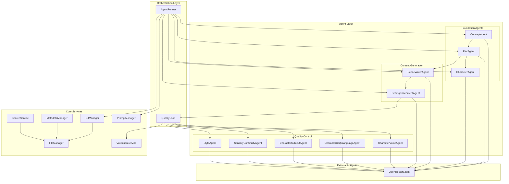
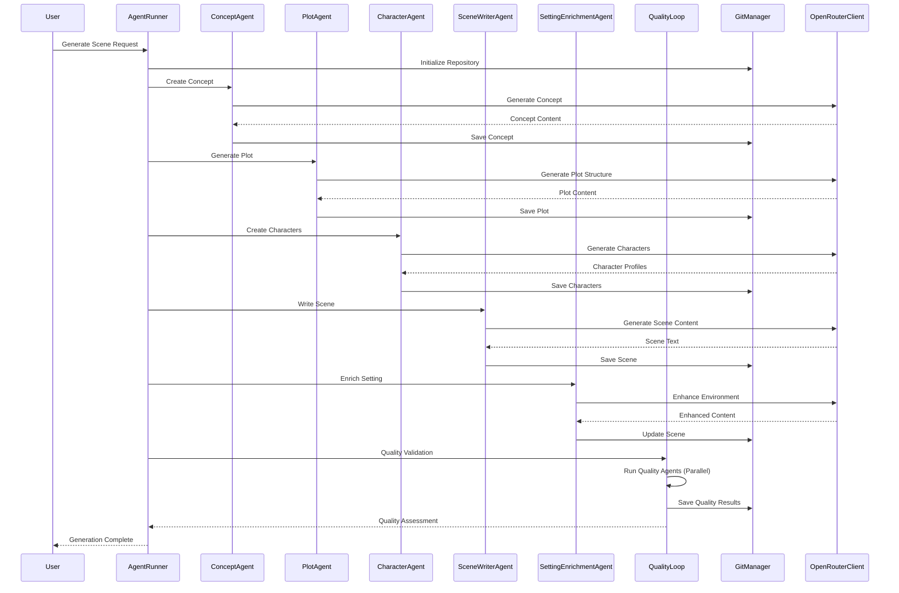
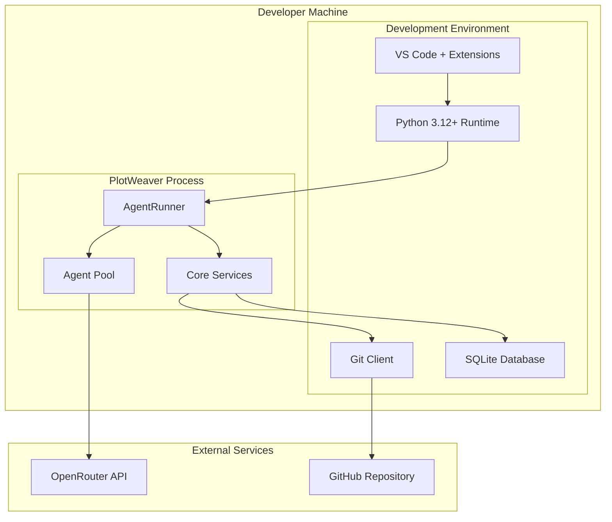
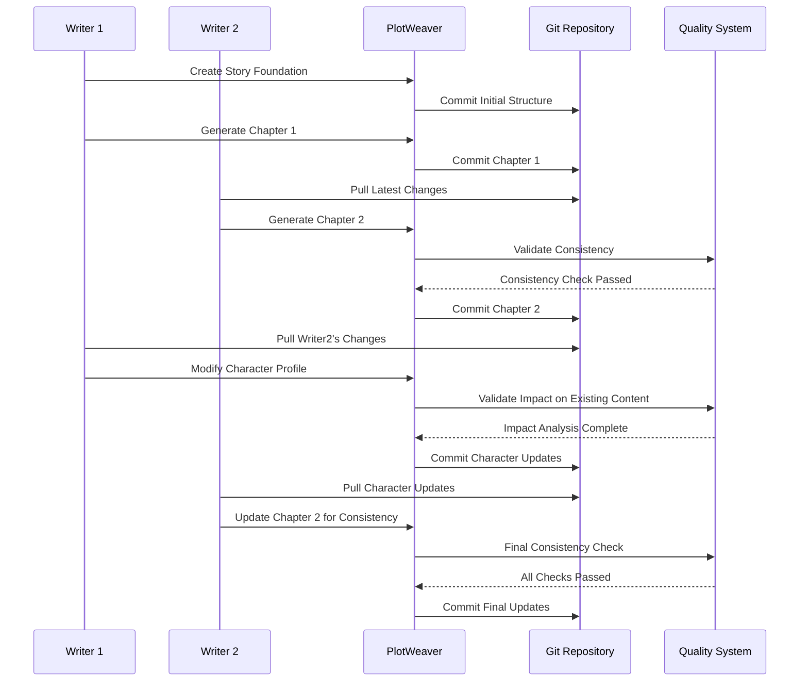
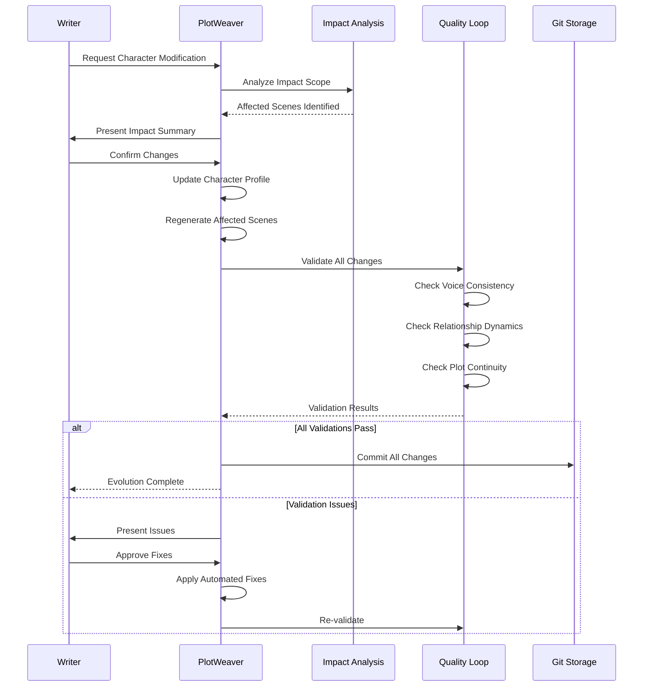
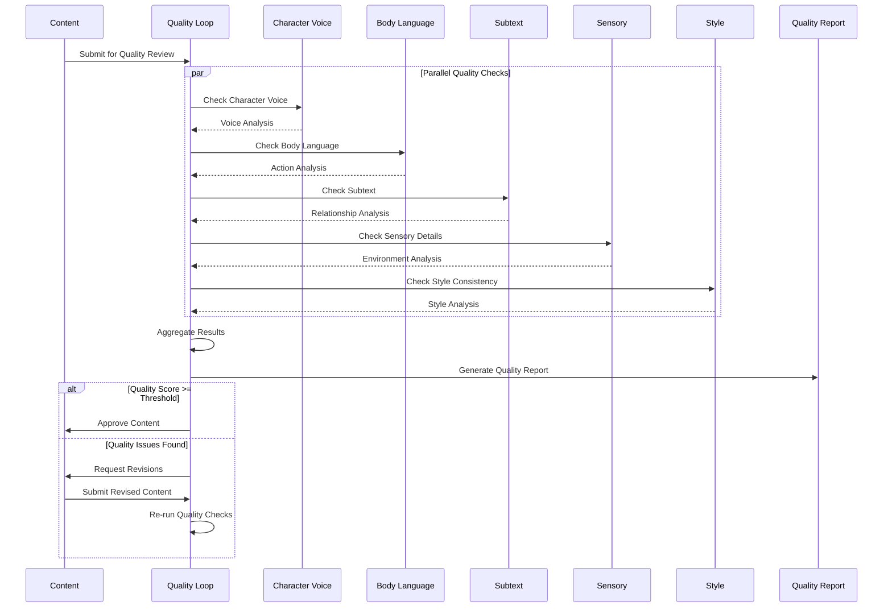

# PlotWeaver Architecture: 4+1 View Model

Last Updated: 2025-06-29

## Logical View (Functionality)

The system is organized around a sophisticated multi-agent architecture with clear functional decomposition:



### Core Functional Domains

#### 1. Story Foundation Layer
- **ConceptAgent**: Core story concept development and narrative structure
- **PlotAgent**: Chapter and scene outline generation with metadata contracts
- **CharacterAgent**: Character profile creation and development

#### 2. Content Generation Layer
- **SceneWriterAgent**: Scene content generation with narrative structure
- **SettingEnrichmentAgent**: Environmental and sensory detail enhancement

#### 3. Quality Assurance Layer
- **CharacterVoiceAgent**: Dialogue authenticity and voice consistency
- **CharacterBodyLanguageAgent**: Physical actions and non-verbal communication
- **CharacterSubtextAgent**: Hidden meanings and relationship dynamics
- **SensoryContinuityAgent**: Environmental consistency and sensory details
- **StyleAgent**: Writing style consistency across scenes

#### 4. Orchestration Layer
- **AgentRunner**: Agent execution coordination and workflow management
- **QualityLoop**: Iterative quality improvement process management

#### 5. Infrastructure Layer
- **GitManager**: Version control and repository management
- **FileManager**: File system operations and content management
- **MetadataManager**: YAML metadata management and validation
- **SearchService**: Content search and indexing capabilities
- **PromptManager**: Prompt template management and rendering
- **ValidationService**: Data validation and schema checking

#### 6. Integration Layer
- **OpenRouterClient**: LLM API integration for AI model access

## Process View (Dynamic Behavior)

### Complete Story Generation Pipeline


### Quality Loop Process (Detailed)
```mermaid
sequenceDiagram
    participant QL as QualityLoop
    participant CVA as CharacterVoiceAgent
    participant CBA as CharacterBodyLanguageAgent
    participant CSA as CharacterSubtextAgent
    participant SCA as SensoryContinuityAgent
    participant STA as StyleAgent
    participant ORC as OpenRouterClient
    participant VS as ValidationService

    QL->>QL: Initialize Quality Check
    
    par Voice Validation
        QL->>CVA: Check Character Voice
        CVA->>ORC: Analyze Dialogue
        ORC-->>CVA: Voice Assessment
        CVA->>VS: Validate Results
        VS-->>CVA: Validation Status
        CVA-->>QL: Voice Results
    and Body Language Validation
        QL->>CBA: Check Body Language
        CBA->>ORC: Analyze Actions
        ORC-->>CBA: Action Assessment
        CBA->>VS: Validate Results
        VS-->>CBA: Validation Status
        CBA-->>QL: Body Language Results
    and Subtext Validation
        QL->>CSA: Check Subtext
        CSA->>ORC: Analyze Relationships
        ORC-->>CSA: Subtext Assessment
        CSA->>VS: Validate Results
        VS-->>CSA: Validation Status
        CSA-->>QL: Subtext Results
    and Sensory Validation
        QL->>SCA: Check Sensory Continuity
        SCA->>ORC: Analyze Environment
        ORC-->>SCA: Sensory Assessment
        SCA->>VS: Validate Results
        VS-->>SCA: Validation Status
        SCA-->>QL: Sensory Results
    and Style Validation
        QL->>STA: Check Style Consistency
        STA->>ORC: Analyze Style
        ORC-->>STA: Style Assessment
        STA->>VS: Validate Results
        VS-->>STA: Validation Status
        STA-->>QL: Style Results
    end
    
    QL->>QL: Aggregate Quality Results
    QL->>QL: Determine Iteration Need
    
    alt Quality Threshold Met
        QL->>QL: Mark Complete
    else Quality Improvement Needed
        QL->>QL: Initiate Improvement Cycle
        QL->>QL: Recursive Quality Check
    end

### Concurrency and Performance Patterns

#### Agent Execution Concurrency
- **Foundation Agents**: Sequential execution (concept → plot → characters)
- **Quality Agents**: Parallel execution for performance optimization
- **Content Generation**: Pipeline execution with dependency management

#### Resource Management
- **Connection Pooling**: OpenRouter API connections managed with rate limiting
- **Memory Management**: Agent context isolation and cleanup
- **Error Recovery**: Circuit breakers and exponential backoff for external services

#### Performance Characteristics
- **Throughput**: 5-10 scenes per hour depending on complexity
- **Latency**: 2-5 minutes per scene generation cycle
- **Scalability**: Horizontal scaling through agent pool management

## Development View (Implementation)

### Complete Package Organization
```mermaid
graph TD
    subgraph "src/plotweaver/"
        subgraph "agents/"
            subgraph "base/"
                BA[base_agent.py]
                AC[agent_context.py]
                AR[agent_result.py]
                EX[exceptions.py]
            end
            
            subgraph "setting/"
                CA[concept_agent.py]
                PA[plot_agent.py]
                CHA[character_agent.py]
            end
            
            subgraph "writing/"
                SWA[scene_writer_agent.py]
            end
            
            subgraph "enhancement/"
                SEA[setting_enrichment_agent.py]
            end
            
            subgraph "quality/"
                CVA[character_voice_agent.py]
                CBA[character_body_language_agent.py]
                CSA[character_subtext_agent.py]
                SCA[sensory_continuity_agent.py]
                STA[style_agent.py]
            end
        end
        
        subgraph "orchestration/"
            ARU[agent_runner.py]
            QL[quality_loop.py]
        end
        
        subgraph "core/"
            CFG[config.py]
            GM[git_manager.py]
            PC[project_config.py]
        end
        
        subgraph "storage/"
            FM[file_manager.py]
            MM[metadata_manager.py]
        end
        
        subgraph "search/"
            SS[search_service.py]
        end
        
        subgraph "utils/"
            PM[prompt_manager.py]
            VAL[validation.py]
        end
        
        subgraph "migration/"
            ORC[openrouter_client.py]
        end
    end
    
    subgraph "tests/"
        subgraph "agents/"
            TA[test_agents/]
        end
        subgraph "core/"
            TC[test_core/]
        end
        subgraph "integration/"
            TI[test_integration/]
        end
    end
```

### Technology Stack and Dependencies

#### Core Technologies
- **Python 3.12+**: Primary development language
- **Git 2.30+**: Version control and content storage
- **SQLite 3.35+**: Full-text search indexing
- **YAML**: Configuration and metadata contracts
- **Markdown**: Content format and documentation

#### Key Dependencies (from pyproject.toml)
```toml
[dependencies]
openai = "^1.0.0"           # LLM API integration
pyyaml = "^6.0"             # YAML processing
gitpython = "^3.1.0"        # Git operations
click = "^8.0.0"            # CLI interface
jinja2 = "^3.1.0"           # Template processing
pydantic = "^2.0.0"         # Data validation
pytest = "^7.0.0"           # Testing framework
```

### Development Environment Setup

#### Required Tools
- **Python 3.12+** with pip and venv
- **Git** with proper authentication
- **VS Code** with Python and YAML extensions
- **OpenRouter API Key** for LLM access

#### Development Workflow
1. **Environment Setup**: `python -m venv venv && source venv/bin/activate`
2. **Dependency Installation**: `pip install -e .`
3. **Configuration**: Set environment variables (OPENROUTER_API_KEY, etc.)
4. **Testing**: `pytest tests/` for validation
5. **Development**: Agent-first development with TDD approach

### Build and Deployment Patterns

#### Package Structure
- **Modular Design**: Clear separation between agents, orchestration, and infrastructure
- **Plugin Architecture**: Agents can be developed and tested independently
- **Configuration-Driven**: YAML-based configuration for flexibility
- **Contract-First**: Well-defined interfaces between components

#### Testing Strategy
- **Unit Tests**: Individual agent and service testing
- **Integration Tests**: End-to-end workflow validation
- **Contract Tests**: YAML schema and API contract validation
- **Performance Tests**: Load testing for agent execution

#### Development Guidelines
- **Agent Inheritance**: All agents extend BaseAgent with standard lifecycle
- **Error Handling**: Comprehensive exception hierarchy and recovery patterns
- **Logging**: Structured logging for debugging and monitoring
- **Documentation**: Inline documentation and architectural decision records

## Physical View (Deployment)

### Local Development Environment


### Production Deployment Architecture
```mermaid
graph TD
    subgraph "Application Tier"
        subgraph "API Layer"
            API[REST API Server]
            Auth[Authentication]
            Rate[Rate Limiting]
        end
        
        subgraph "Processing Layer"
            LB[Load Balancer]
            Worker1[Worker Node 1]
            Worker2[Worker Node 2]
            WorkerN[Worker Node N]
        end
        
        subgraph "Orchestration"
            Queue[Task Queue]
            Scheduler[Job Scheduler]
            Monitor[Health Monitor]
        end
    end
    
    subgraph "Data Tier"
        subgraph "Storage"
            GitRepo[Git Repository]
            SearchDB[Search Index]
            MetaDB[Metadata Store]
        end
        
        subgraph "Cache Layer"
            Redis[Redis Cache]
            CDN[Content CDN]
        end
    end
    
    subgraph "External Services"
        OpenRouter[OpenRouter API]
        GitHub[GitHub API]
        Monitoring[Monitoring Services]
    end
    
    API --> Auth
    API --> Rate
    API --> LB
    LB --> Worker1
    LB --> Worker2
    LB --> WorkerN
    
    Worker1 --> Queue
    Worker2 --> Queue
    WorkerN --> Queue
    
    Queue --> Scheduler
    Scheduler --> Monitor
    
    Worker1 --> GitRepo
    Worker1 --> SearchDB
    Worker1 --> MetaDB
    Worker1 --> Redis
    
    Worker1 --> OpenRouter
    Worker1 --> GitHub
    
    Monitor --> Monitoring

### Resource Requirements and Scaling

#### Minimum System Requirements
- **CPU**: 2 cores, 2.0 GHz
- **Memory**: 4GB RAM
- **Storage**: 1GB available space
- **Network**: Stable internet connection for LLM API access

#### Recommended Production Configuration
- **CPU**: 4+ cores, 3.0 GHz
- **Memory**: 8GB+ RAM
- **Storage**: 5GB+ SSD storage
- **Network**: High-bandwidth connection with low latency to LLM providers

#### Scaling Characteristics
- **Horizontal Scaling**: Agent workers can be distributed across multiple nodes
- **Vertical Scaling**: Memory and CPU scaling improves individual agent performance
- **Storage Scaling**: Git-based storage scales with repository size
- **API Scaling**: Rate limiting and connection pooling for external service management

### Deployment Configurations

#### Development Deployment
- **Single Process**: All components in one Python process
- **Local Storage**: Git repository on local filesystem
- **Direct API**: Direct OpenRouter API integration
- **SQLite**: Local search index

#### Staging Deployment
- **Multi-Process**: Separate processes for API and workers
- **Shared Storage**: Network-attached Git repository
- **Connection Pooling**: Managed API connections
- **Monitoring**: Basic health checks and logging

#### Production Deployment
- **Microservices**: Containerized services with orchestration
- **Distributed Storage**: Replicated Git repositories with backup
- **API Gateway**: Rate limiting, authentication, and routing
- **Full Monitoring**: Comprehensive metrics, logging, and alerting

## Scenarios (+1 View)

### 1. Complete Story Generation Workflow
```mermaid
sequenceDiagram
    participant Writer as Writer
    participant System as PlotWeaver
    participant Agents as Agent System
    participant Quality as Quality Loop
    participant Storage as Git Storage

    Writer->>System: Initialize New Project
    System->>Storage: Create Repository
    System->>Agents: Generate Concept
    Agents-->>System: Story Foundation
    
    Writer->>System: Request Scene Generation
    System->>Agents: Execute Generation Pipeline
    Agents->>Agents: Concept → Plot → Characters → Scene
    Agents->>Quality: Submit for Quality Check
    Quality->>Quality: Run 5 Quality Agents
    Quality-->>Agents: Quality Assessment
    
    alt Quality Passed
        Agents->>Storage: Commit Scene
        System-->>Writer: Scene Complete
    else Quality Issues Found
        Quality->>Agents: Request Improvements
        Agents->>Agents: Apply Fixes
        Agents->>Quality: Resubmit for Review
    end
```

**Key Steps:**
1. **Project Initialization**: Writer creates new story project with genre and parameters
2. **Foundation Generation**: ConceptAgent creates core story elements
3. **Plot Development**: PlotAgent generates chapter and scene structure
4. **Character Creation**: CharacterAgent develops character profiles and relationships
5. **Scene Writing**: SceneWriterAgent generates scene content
6. **Setting Enhancement**: SettingEnrichmentAgent adds environmental details
7. **Quality Validation**: 5 quality agents validate different aspects in parallel
8. **Iterative Improvement**: Quality loop refines content until standards are met
9. **Version Control**: Git commits track all changes and iterations

### 2. Collaborative Multi-Writer Workflow


**Collaboration Features:**
- **Shared Repository**: Git-based collaboration with branch management
- **Consistency Validation**: Quality agents ensure character and plot consistency
- **Conflict Resolution**: Automated detection and resolution of narrative conflicts
- **Change Impact Analysis**: System analyzes how changes affect existing content

### 3. Content Evolution and Refinement


**Evolution Capabilities:**
- **Impact Analysis**: Automatic detection of content dependencies
- **Cascading Updates**: Intelligent propagation of changes through related content
- **Consistency Maintenance**: Quality agents ensure narrative coherence
- **Version Tracking**: Complete history of content evolution

### 4. Advanced Quality Assurance Workflow


**Quality Dimensions:**
- **Character Voice**: Dialogue authenticity and consistency
- **Body Language**: Physical action appropriateness and consistency
- **Subtext**: Relationship dynamics and hidden meanings
- **Sensory Continuity**: Environmental consistency and immersion
- **Style Consistency**: Narrative voice and prose style uniformity

### 5. Performance and Scalability Scenarios

#### High-Volume Generation Scenario
- **Input**: 50 scenes requested simultaneously
- **Processing**: Agent pool scales to handle concurrent requests
- **Quality**: Parallel quality validation maintains throughput
- **Output**: Consistent quality maintained at scale

#### Large Project Management Scenario
- **Input**: Novel-length project (100+ scenes, 20+ characters)
- **Processing**: Incremental generation with dependency management
- **Storage**: Efficient Git operations with large content volumes
- **Search**: Fast content discovery across large repositories

#### Multi-Project Collaboration Scenario
- **Input**: Multiple writers working on different projects
- **Processing**: Resource isolation and fair scheduling
- **Quality**: Project-specific quality standards and validation
- **Management**: Cross-project resource optimization

### 6. Error Handling and Recovery Scenarios

#### API Failure Recovery
- **Trigger**: OpenRouter API becomes unavailable
- **Response**: Circuit breaker activates, requests queued
- **Recovery**: Exponential backoff retry with graceful degradation
- **Outcome**: Minimal user impact with transparent recovery

#### Quality Loop Failure
- **Trigger**: Quality agent encounters validation error
- **Response**: Individual agent failure isolation
- **Recovery**: Fallback to pass-through mode for failed agent
- **Outcome**: Partial quality validation continues operation

#### Git Repository Corruption
- **Trigger**: Repository becomes corrupted or inaccessible
- **Response**: Automatic backup restoration
- **Recovery**: Content recovery from last known good state
- **Outcome**: Minimal data loss with full operation restoration

## Implementation Focus

### Current Implementation Status (2025-06-29)

#### ✅ Completed Components
- **Complete Agent Architecture**: All 10 agents implemented and operational
  - Foundation agents (Concept, Plot, Character)
  - Content generation (SceneWriter, SettingEnrichment)
  - Quality control (5 specialized quality agents)
- **Orchestration Layer**: AgentRunner and QualityLoop fully functional
- **Core Infrastructure**: Git integration, file management, metadata handling
- **Quality System**: Parallel quality validation with iterative improvement
- **Development Environment**: Complete development setup and tooling

#### 🚧 Current Development Focus
- **Performance Optimization**: Agent execution efficiency and resource management
- **Error Handling**: Robust error recovery and circuit breaker implementation
- **Testing Coverage**: Comprehensive test suite for all components
- **Documentation**: Complete API documentation and user guides

### Next Phase Priorities

#### Enhanced Collaboration Features
- **Multi-User Support**: Concurrent writer collaboration with conflict resolution
- **Advanced Git Integration**: Branch management and merge strategies
- **Real-Time Collaboration**: Live editing and change synchronization
- **Permission Management**: Role-based access control and project sharing

#### Advanced Quality Features
- **Custom Quality Rules**: User-defined quality criteria and validation
- **Quality Analytics**: Detailed quality metrics and improvement tracking
- **Adaptive Quality**: Machine learning-enhanced quality assessment
- **Quality Templates**: Genre-specific and style-specific quality profiles

#### Performance and Scalability
- **Horizontal Scaling**: Multi-node deployment and load distribution
- **Caching Layer**: Intelligent caching for improved response times
- **Batch Processing**: Efficient bulk content generation and validation
- **Resource Optimization**: Memory and CPU usage optimization

### Future Architectural Considerations

#### Cloud-Native Deployment
- **Containerization**: Docker-based deployment with Kubernetes orchestration
- **Microservices**: Service decomposition for independent scaling
- **API Gateway**: Centralized API management and routing
- **Monitoring**: Comprehensive observability and alerting

#### Extended Integration Capabilities
- **Multi-LLM Support**: Integration with multiple AI providers
- **External Tool Integration**: Writing software and publishing platform integration
- **Advanced Search**: Semantic search and content discovery
- **Analytics Platform**: Writing analytics and improvement insights

#### Advanced Features
- **AI-Assisted Editing**: Real-time writing assistance and suggestions
- **Content Templates**: Genre-specific templates and story structures
- **Publishing Pipeline**: Direct integration with publishing platforms
- **Community Features**: Writer communities and content sharing

### Architectural Evolution Strategy

#### Backward Compatibility
- **API Versioning**: Maintain compatibility across system evolution
- **Migration Tools**: Automated migration for system upgrades
- **Configuration Management**: Flexible configuration for different deployment scenarios

#### Technology Adoption
- **Emerging AI Models**: Integration with latest language models
- **Modern Development Practices**: Continuous integration and deployment
- **Security Enhancements**: Advanced security and privacy protection
- **Performance Technologies**: Latest performance optimization techniques
