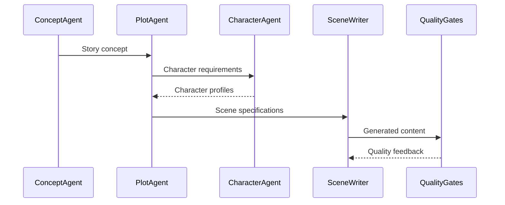
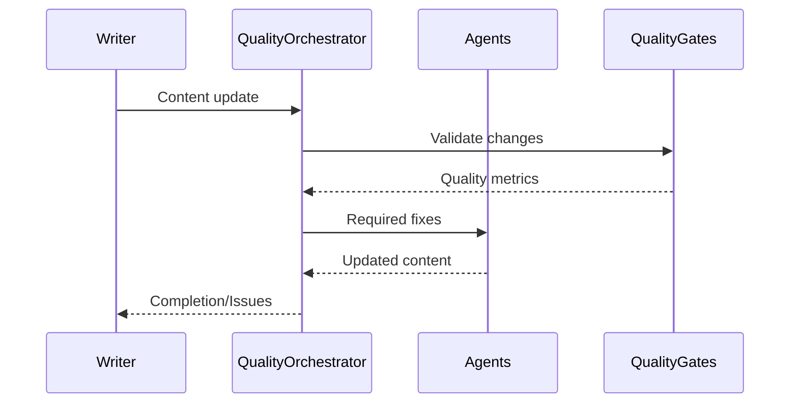
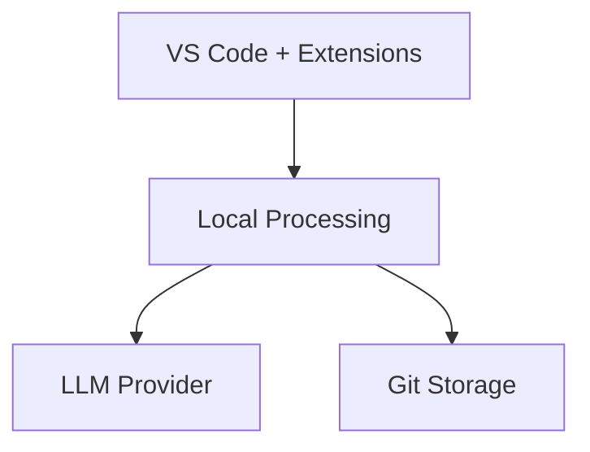
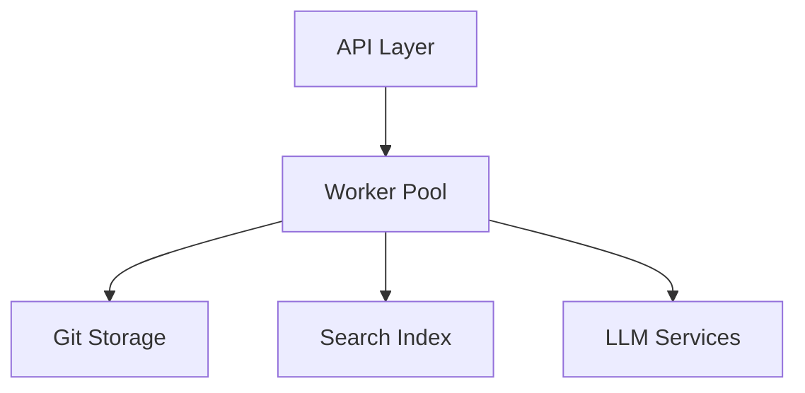

# PlotWeaver Architecture: 4+1 View Model

## Logical View (Functionality)

The system is organized around core story generation capabilities:

### Core Domains
- Story Generation Engine
  - ConceptAgent: Core story foundation
  - PlotAgent: Scene and chapter planning
  - CharacterAgent: Character development
  - SceneWriterAgent: Content generation
  - SettingEnrichmentAgent: Environmental details

### Quality System
- Quality Gates
  - Voice authenticity
  - Character consistency
  - Setting coherence
  - Narrative flow

### Content Management
- Git-native storage
- YAML-based contracts
- Search indexing
- Version control

## Process View (Dynamic Behavior)

### Story Generation Pipeline


### Quality Feedback Loop


## Development View (Implementation)

### Component Organization
```
src/plotweaver/
├── agents/           # Core generation agents
├── quality/          # Quality validation
├── core/            # System infrastructure
├── orchestration/   # Process management
└── storage/         # Content persistence
```

### Key Technologies
- Python 3.12+
- Git for storage
- SQLite for search
- YAML for contracts
- Markdown for content

### Development Patterns
- Agent-based architecture
- Event-driven processing
- Contract-first design
- Test-driven development

## Physical View (Deployment)

### Local Development


### Production Deployment


## Scenarios (Use Cases)

### 1. Basic Story Generation
1. User provides initial concept
2. System generates foundational elements
3. Scene-by-scene generation with quality checks
4. Content refinement through feedback loop

### 2. Collaborative Editing
1. Multiple writers access shared repository
2. Changes tracked through git
3. Quality gates ensure consistency
4. Merge conflicts handled through git

### 3. Content Evolution
1. Writer modifies existing content
2. System analyzes impact
3. Related content updated for consistency
4. Quality gates validate changes

### 4. Quality Assurance
1. Content submitted for review
2. Multiple quality gates assess
3. Issues identified and categorized
4. Automated fixes where possible

## Implementation Focus

### Current Priority
- Core generation pipeline
- Basic quality gates
- Git integration
- Local development workflow

### Next Phase
- Enhanced quality checks
- Collaborative features
- Advanced orchestration
- Performance optimization

### Future Considerations
- Cloud deployment
- Multi-user scaling
- Extended LLM support
- Advanced search capabilities