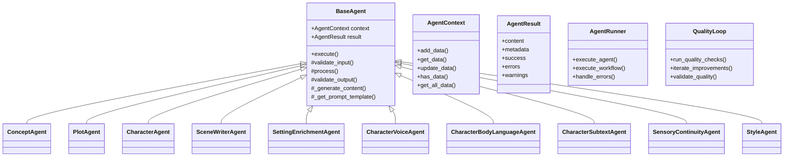
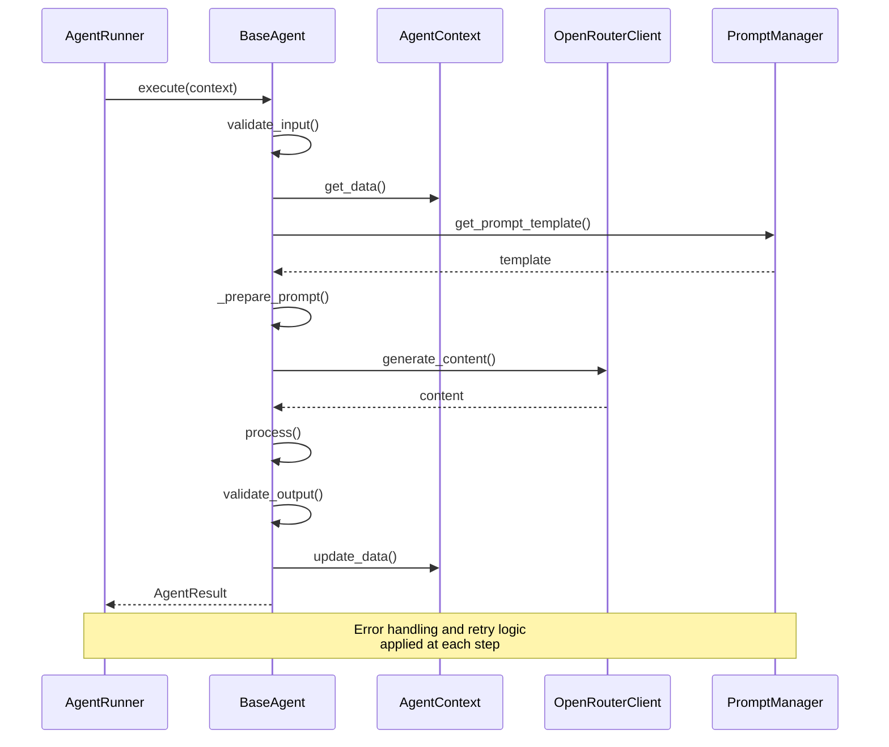
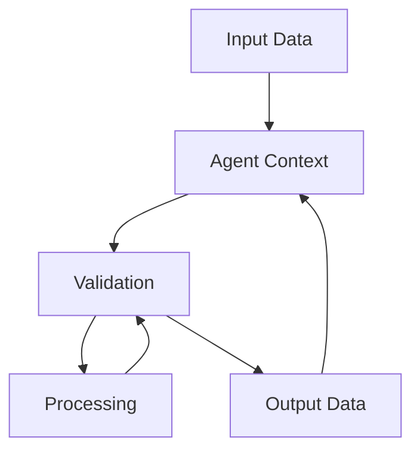
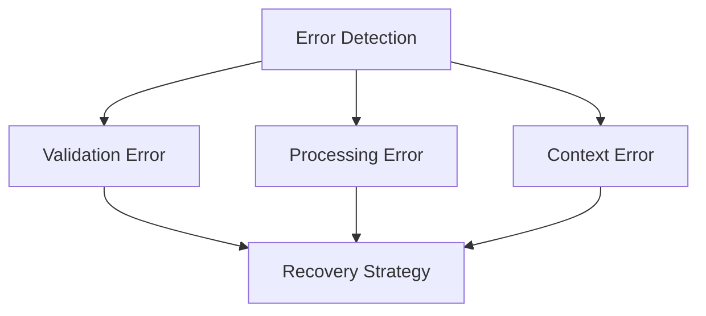

# Agent Architecture

Last Updated: 2025-06-29

## System Overview



## Core Components

### Base Infrastructure (agents/base/)

#### agent_context.py
- Shared state between agents
- Data passing and transformation
- Context validation
- History tracking

#### agent_result.py
- Standardized output format
- Success/failure tracking
- Error aggregation
- Metadata management

#### base_agent.py
- Core agent lifecycle
- Common validation
- Error handling
- LLM integration

#### exceptions.py
- Agent-specific errors
- Validation failures
- Processing errors
- Context errors

## Agent Types

### Setting Generation (agents/setting/)

#### ConceptAgent
- Purpose: Story foundation and world rules
- Input: User requirements
- Output: Initial story concept
- Key responsibilities:
  - Genre interpretation
  - Theme development
  - Core conflict definition

#### PlotAgent
- Purpose: Story structure and flow
- Input: Story concept
- Output: Scene specifications
- Key responsibilities:
  - Plot outline
  - Scene sequencing
  - Story arc management

#### CharacterAgent
- Purpose: Character development
- Input: Story and plot context
- Output: Character profiles
- Key responsibilities:
  - Character creation
  - Relationship mapping
  - Arc development

### Content Generation (agents/writing/)

#### SceneWriterAgent
- Purpose: Narrative content creation
- Input: Scene specifications
- Output: Scene content
- Key responsibilities:
  - Content generation
  - Style consistency
  - Narrative flow

### Enhancement (agents/enhancement/)

#### SettingEnrichmentAgent
- Purpose: Scene enhancement with environmental and sensory details
- Input: Base scene content
- Output: Enhanced scene with setting details
- Key responsibilities:
  - Environmental detail enhancement
  - Sensory description enrichment
  - Atmosphere development

### Orchestration (orchestration/)

#### AgentRunner
- Purpose: Agent execution coordination and workflow management
- Input: Agent execution requests and context
- Output: Coordinated agent results
- Key responsibilities:
  - Agent lifecycle management
  - Workflow coordination
  - Error handling and recovery
  - Context management between agents

#### QualityLoop
- Purpose: Iterative quality improvement process management
- Input: Content requiring quality validation
- Output: Quality-validated and improved content
- Key responsibilities:
  - Quality agent coordination
  - Iterative improvement cycles
  - Quality threshold validation
  - Improvement convergence detection

### Quality Control (agents/quality/)

#### CharacterVoiceAgent
- Purpose: Dialogue authenticity and voice consistency validation
- Domain: Words spoken in dialogue, speech patterns, vocabulary
- Input: Scene content with character dialogue
- Output: Voice consistency assessment and corrections
- Key responsibilities:
  - Character voice validation
  - Dialogue authenticity checking
  - Speech pattern consistency

#### CharacterBodyLanguageAgent
- Purpose: Physical actions and non-verbal communication validation
- Domain: Body language, gestures, physical descriptions
- Input: Scene content with character actions
- Output: Body language consistency assessment
- Key responsibilities:
  - Physical action validation
  - Gesture consistency checking
  - Non-verbal communication analysis

#### CharacterSubtextAgent
- Purpose: Hidden meanings and relationship dynamics analysis
- Domain: Subtext, power dynamics, emotional undertones
- Input: Scene content with character interactions
- Output: Subtext analysis and relationship validation
- Key responsibilities:
  - Subtext identification
  - Relationship dynamic analysis
  - Emotional undertone validation

#### SensoryContinuityAgent
- Purpose: Environmental consistency and sensory details validation
- Domain: Setting descriptions, sensory elements, world consistency
- Input: Scene content with environmental descriptions
- Output: Sensory continuity assessment
- Key responsibilities:
  - Environmental consistency checking
  - Sensory detail validation
  - World-building continuity

#### StyleAgent
- Purpose: Writing style consistency across scenes
- Domain: Prose style, tone, narrative voice
- Input: Scene content for style analysis
- Output: Style consistency assessment and recommendations
- Key responsibilities:
  - Style consistency validation
  - Tone analysis
  - Narrative voice checking

## Agent Lifecycle



## Interaction Patterns

### Data Flow


### Error Handling


## Development Guide

### Adding New Agent
1. Create new class in appropriate directory (`setting/`, `writing/`, `quality/`, `enhancement/`)
2. Inherit from BaseAgent
3. Implement required methods:
   ```python
   class NewAgent(BaseAgent):
       def __init__(self, openrouter_client, prompt_manager):
           super().__init__(openrouter_client, prompt_manager)
           self.agent_name = "new_agent"

       def validate_input(self, context: AgentContext) -> bool:
           # Input validation logic
           required_keys = ["input_key1", "input_key2"]
           for key in required_keys:
               if not context.has_data(key):
                   raise AgentValidationError(f"Missing required data: {key}")
           return True

       def process(self, context: AgentContext) -> AgentResult:
           # Core processing logic
           input_data = context.get_data("input_key")
           
           # Get prompt template
           template = self._get_prompt_template("new_agent_prompt")
           
           # Generate content using LLM
           result = self._generate_content(template, input_data)
           
           # Update context
           context.add_data("output_key", result)
           
           return AgentResult(content=result, success=True)

       def validate_output(self, result: AgentResult) -> bool:
           # Output validation logic
           if not result.content or len(result.content.strip()) == 0:
               return False
           return True
   ```
4. Add prompt template in `prompts/agents/`
5. Add corresponding tests in `tests/agents/`
6. Update agent runner configuration if needed
7. Add to components.yaml specification

### Agent Best Practices
- Keep agents focused and single-purpose
- Use context for data passing
- Implement thorough validation
- Handle errors gracefully
- Document agent contracts
- Test all paths

### Common Patterns
1. Context Usage
   ```python
   def process(self, context: AgentContext) -> AgentResult:
       # Get input data
       input_data = context.get_data("input_key")
       
       # Process using LLM
       result = self._generate_content(input_data)
       
       # Update context
       context.add_data("output_key", result)
       
       return AgentResult(content=result)
   ```

2. Validation
   ```python
   def validate_input(self, context: AgentContext) -> bool:
       required_keys = ["story_concept", "plot_outline"]
       
       for key in required_keys:
           if not context.has_data(key):
               raise AgentValidationError(f"Missing required data: {key}")
               
       return True
   ```

3. Error Handling
   ```python
   def process(self, context: AgentContext) -> AgentResult:
       try:
           # Validate input first
           if not self.validate_input(context):
               return AgentResult(
                   success=False,
                   errors=["Input validation failed"]
               )
           
           # Core processing
           result = self._core_processing(context)
           
           # Validate output
           agent_result = AgentResult(content=result, success=True)
           if not self.validate_output(agent_result):
               return AgentResult(
                   success=False,
                   errors=["Output validation failed"]
               )
           
           return agent_result
           
       except AgentValidationError as e:
           return AgentResult(
               success=False,
               errors=[f"Validation error: {str(e)}"]
           )
       except LLMError as e:
           return AgentResult(
               success=False,
               errors=[f"LLM error: {str(e)}"]
           )
       except Exception as e:
           return AgentResult(
               success=False,
               errors=[f"Unexpected error: {str(e)}"]
           )
   ```

## Testing Strategy

### Unit Tests
- Input validation
- Processing logic
- Output validation
- Error handling
- Context management

### Integration Tests
- Agent chains
- Context passing
- LLM integration
- Error propagation

### Functional Tests
- End-to-end flows
- Complex scenarios
- Edge cases
- Performance
