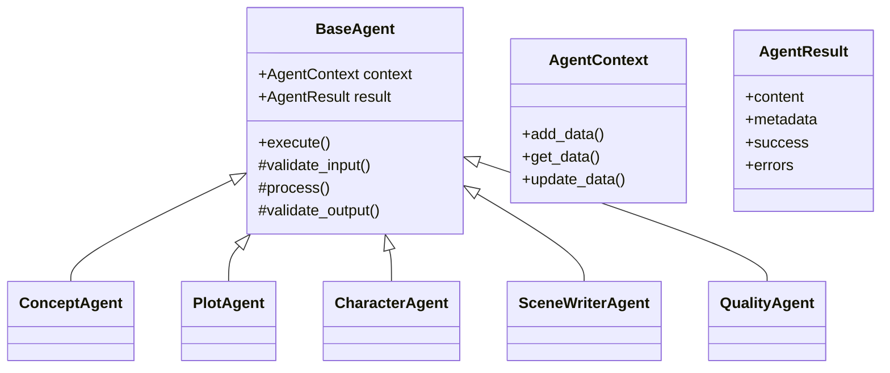
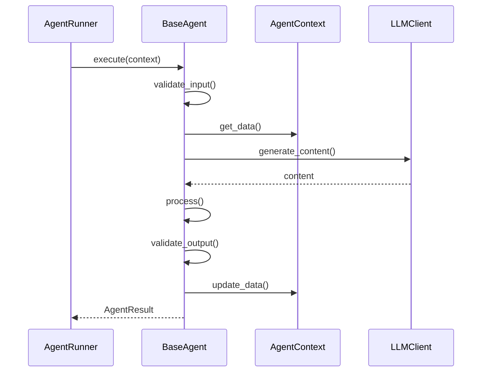
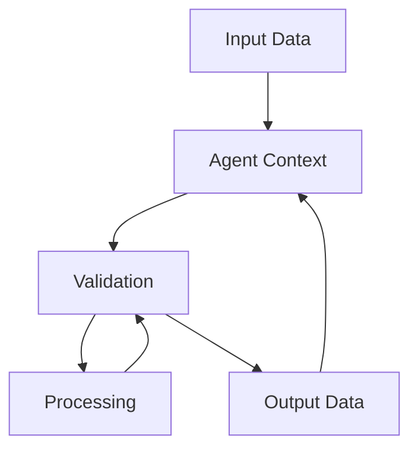
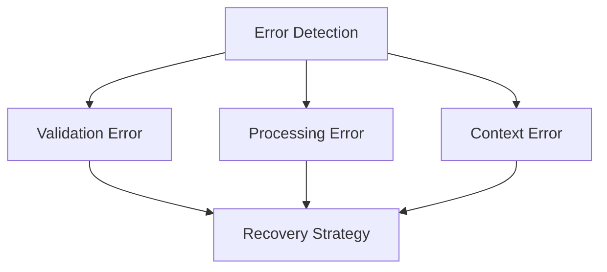

# Agent Architecture

## System Overview



## Core Components

### Base Infrastructure (agents/base/)

#### agent_context.py
- Shared state between agents
- Data passing and transformation
- Context validation
- History tracking

#### agent_result.py
- Standardized output format
- Success/failure tracking
- Error aggregation
- Metadata management

#### base_agent.py
- Core agent lifecycle
- Common validation
- Error handling
- LLM integration

#### exceptions.py
- Agent-specific errors
- Validation failures
- Processing errors
- Context errors

## Agent Types

### Setting Generation (agents/setting/)

#### ConceptAgent
- Purpose: Story foundation and world rules
- Input: User requirements
- Output: Initial story concept
- Key responsibilities:
  - Genre interpretation
  - Theme development
  - Core conflict definition

#### PlotAgent
- Purpose: Story structure and flow
- Input: Story concept
- Output: Scene specifications
- Key responsibilities:
  - Plot outline
  - Scene sequencing
  - Story arc management

#### CharacterAgent
- Purpose: Character development
- Input: Story and plot context
- Output: Character profiles
- Key responsibilities:
  - Character creation
  - Relationship mapping
  - Arc development

### Content Generation (agents/writing/)

#### SceneWriterAgent
- Purpose: Narrative content creation
- Input: Scene specifications
- Output: Scene content
- Key responsibilities:
  - Content generation
  - Style consistency
  - Narrative flow

### Quality Control (agents/quality/)
- Purpose: Content validation and improvement
- Input: Generated content
- Output: Quality assessment and fixes
- Key responsibilities:
  - Style checking
  - Consistency validation
  - Error detection

## Agent Lifecycle



## Interaction Patterns

### Data Flow


### Error Handling


## Development Guide

### Adding New Agent
1. Create new class in appropriate directory
2. Inherit from BaseAgent
3. Implement required methods:
   ```python
   class NewAgent(BaseAgent):
       def validate_input(self, context: AgentContext) -> bool:
           # Input validation logic
           pass

       def process(self, context: AgentContext) -> AgentResult:
           # Core processing logic
           pass

       def validate_output(self, result: AgentResult) -> bool:
           # Output validation logic
           pass
   ```
4. Add corresponding tests
5. Update agent runner if needed

### Agent Best Practices
- Keep agents focused and single-purpose
- Use context for data passing
- Implement thorough validation
- Handle errors gracefully
- Document agent contracts
- Test all paths

### Common Patterns
1. Context Usage
   ```python
   def process(self, context: AgentContext) -> AgentResult:
       # Get input data
       input_data = context.get_data("input_key")
       
       # Process using LLM
       result = self._generate_content(input_data)
       
       # Update context
       context.add_data("output_key", result)
       
       return AgentResult(content=result)
   ```

2. Validation
   ```python
   def validate_input(self, context: AgentContext) -> bool:
       required_keys = ["story_concept", "plot_outline"]
       
       for key in required_keys:
           if not context.has_data(key):
               raise AgentValidationError(f"Missing required data: {key}")
               
       return True
   ```

3. Error Handling
   ```python
   def process(self, context: AgentContext) -> AgentResult:
       try:
           result = self._core_processing()
       except LLMError as e:
           return AgentResult(
               success=False,
               errors=[str(e)]
           )
       except ValidationError as e:
           return AgentResult(
               success=False,
               errors=[f"Validation failed: {str(e)}"]
           )
       
       return AgentResult(content=result)
   ```

## Testing Strategy

### Unit Tests
- Input validation
- Processing logic
- Output validation
- Error handling
- Context management

### Integration Tests
- Agent chains
- Context passing
- LLM integration
- Error propagation

### Functional Tests
- End-to-end flows
- Complex scenarios
- Edge cases
- Performance