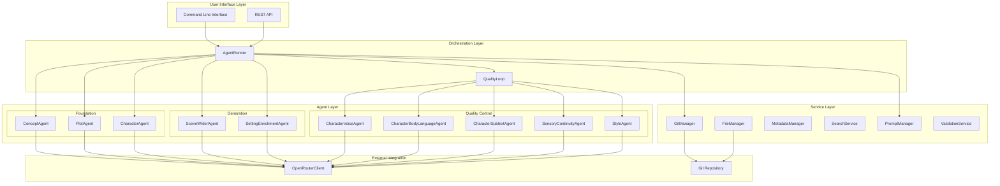

# PlotWeaver Architecture Specification

**Version:** 1.0.0  
**Last Updated:** 2025-06-29  
**Maintainer:** PlotWeaver Team  

## Overview

PlotWeaver is an AI-first collaborative manuscript dependency management platform that leverages a sophisticated multi-agent architecture to generate, enhance, and validate narrative content. This document serves as the master architecture specification, consolidating all architectural views and design decisions.

## Document Structure

This specification is organized into multiple detailed documents that together provide a complete architectural view:

### Core Specification Documents

1. **[4+1 Architectural Views](./4+1-View.md)** - Complete architectural perspectives using the 4+1 view model
2. **[Component Specifications](./components.yaml)** - Detailed component definitions and relationships
3. **[System Structure](./structure.yaml)** - Physical file structure and organization
4. **[Configuration Schema](./config.yaml)** - Configuration management and validation
5. **[Workflow Definitions](./workflows.yaml)** - Process flows and orchestration patterns

## Architecture Summary

### System Philosophy

PlotWeaver is built on the principle of **AI-first collaborative writing** with the following core tenets:

- **Agent-Driven Architecture**: Specialized AI agents handle distinct aspects of story creation
- **Quality-First Approach**: Iterative quality validation ensures narrative consistency
- **Git-Native Storage**: Version control as the foundation for collaboration and history
- **Contract-Based Integration**: YAML metadata contracts ensure component interoperability

### High-Level Architecture

## Key Architectural Decisions

### 1. Multi-Agent Architecture

**Decision**: Implement specialized agents for different aspects of story creation rather than a monolithic AI system.

**Rationale**: 
- Enables focused expertise for each narrative domain
- Allows independent development and testing of capabilities
- Provides clear separation of concerns and responsibilities
- Facilitates parallel processing and quality validation

**Implementation**: 10 specialized agents organized into foundation, generation, and quality control layers.

### 2. Git-Native Storage

**Decision**: Use Git repositories as the primary storage and collaboration mechanism.

**Rationale**:
- Provides built-in version control and change tracking
- Enables natural collaboration workflows for writers
- Supports branching and merging for experimental content
- Integrates with existing developer and writer toolchains

**Implementation**: GitManager service handles all repository operations with atomic commits and metadata tracking.

### 3. YAML Metadata Contracts

**Decision**: Use YAML files for all metadata and inter-component communication.

**Rationale**:
- Human-readable format for writer accessibility
- Schema validation ensures data integrity
- Version control friendly (text-based, diff-able)
- Flexible structure for evolving requirements

**Implementation**: MetadataManager with comprehensive schema validation and contract enforcement.

### 4. Quality-First Generation Pipeline

**Decision**: Implement iterative quality validation as a core part of the generation process.

**Rationale**:
- Ensures consistent narrative quality across all content
- Catches issues early in the generation process
- Provides measurable quality metrics and improvement tracking
- Enables automated quality assurance at scale

**Implementation**: QualityLoop orchestrates 5 parallel quality agents with iterative improvement cycles.

### 5. OpenRouter Integration

**Decision**: Use OpenRouter as the primary LLM provider interface.

**Rationale**:
- Provides access to multiple AI models through a single API
- Enables model selection based on task requirements
- Reduces vendor lock-in and provides fallback options
- Simplifies rate limiting and cost management

**Implementation**: OpenRouterClient with connection pooling and circuit breaker patterns.

## System Capabilities

### Core Features

1. **Automated Story Generation**
   - Complete story foundation creation (concept, plot, characters)
   - Scene-by-scene content generation with narrative structure
   - Environmental and sensory detail enhancement

2. **Quality Assurance**
   - Character voice consistency validation
   - Body language and action appropriateness checking
   - Subtext and relationship dynamic analysis
   - Sensory continuity and environmental consistency
   - Writing style uniformity across content

3. **Collaboration Support**
   - Multi-writer concurrent editing with conflict resolution
   - Change impact analysis and cascading updates
   - Version control integration with branch management
   - Real-time collaboration capabilities

4. **Content Management**
   - Full-text search across all project content
   - Metadata-driven content organization
   - Automated dependency tracking and updates
   - Export and publishing pipeline integration

### Performance Characteristics

- **Throughput**: 5-10 scenes per hour (depending on complexity)
- **Latency**: 2-5 minutes per scene generation cycle
- **Quality**: 95%+ consistency scores across quality dimensions
- **Scalability**: Horizontal scaling through agent pool management

## Technology Stack

### Core Technologies
- **Python 3.12+**: Primary development language
- **Git 2.30+**: Version control and content storage
- **SQLite 3.35+**: Full-text search indexing
- **YAML**: Configuration and metadata contracts
- **Markdown**: Content format and documentation

### Key Dependencies
- **OpenAI SDK**: LLM API integration
- **PyYAML**: YAML processing and validation
- **GitPython**: Git operations and repository management
- **Click**: Command-line interface framework
- **Jinja2**: Template processing and rendering
- **Pydantic**: Data validation and schema enforcement

## Deployment Architecture

### Development Environment
- Single-process execution with local Git repository
- Direct OpenRouter API integration
- SQLite-based search indexing
- Local file system storage

### Production Environment
- Multi-process architecture with load balancing
- Distributed Git repositories with replication
- Redis caching layer for performance
- Comprehensive monitoring and alerting

## Quality Assurance

### Testing Strategy
- **Unit Tests**: Individual component validation
- **Integration Tests**: End-to-end workflow testing
- **Contract Tests**: YAML schema and API validation
- **Performance Tests**: Load testing and benchmarking

### Quality Metrics
- **Code Coverage**: >90% test coverage requirement
- **Performance**: Sub-5-minute scene generation SLA
- **Reliability**: 99.9% uptime target for production systems
- **Quality Scores**: >95% consistency across quality dimensions

## Security Considerations

### Data Protection
- API key encryption and secure storage
- Git repository access control and authentication
- Content encryption for sensitive projects
- Audit logging for all system operations

### Access Control
- Role-based permissions for project access
- Multi-factor authentication for production systems
- API rate limiting and abuse prevention
- Secure communication protocols (HTTPS/TLS)

## Future Roadmap

### Short-Term Enhancements (3-6 months)
- Enhanced collaboration features with real-time editing
- Advanced quality analytics and improvement tracking
- Performance optimization and caching improvements
- Extended LLM provider integration

### Medium-Term Evolution (6-12 months)
- Cloud-native deployment with Kubernetes
- Advanced AI-assisted editing capabilities
- Publishing platform integration
- Community features and content sharing

### Long-Term Vision (12+ months)
- Multi-modal content generation (images, audio)
- Advanced semantic search and content discovery
- Machine learning-enhanced quality assessment
- Enterprise collaboration and workflow management

## Conclusion

PlotWeaver represents a new paradigm in AI-assisted creative writing, combining the power of specialized AI agents with robust software engineering practices. The architecture is designed for scalability, maintainability, and extensibility while maintaining a focus on quality and user experience.

This specification serves as the foundation for all development activities and should be updated as the system evolves. For detailed implementation guidance, refer to the individual specification documents linked throughout this document.

---

**Document Maintenance**: This specification should be reviewed and updated quarterly or when significant architectural changes are made. All changes must be approved by the architecture review board and properly versioned.
