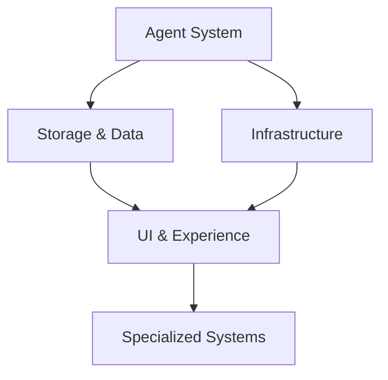

# Complete Feature Analysis by Core Component

Last Updated: 2025-06-29

## Overview
This document analyzes all proposed features grouped by their primary core component impact. This organization helps identify component-level dependencies, resource allocation needs, and architectural evolution patterns.

## Feature Classification Summary

**Total Features Analyzed:** 20
- Must Have: 11 features
- Should Have: 2 features  
- Could Have: 0 features
- Won't Have: 0 features
- Evaluations: 7 features

## Core Component Impact Analysis

### Agent System (7 features)
The Agent System represents the core AI infrastructure that drives PlotWeaver's content generation and quality management. This component cluster focuses on intelligent agent coordination, from specialized micro-agents for character voice and body language to sophisticated orchestration systems that optimize model selection and quality loops. The system emphasizes cost optimization through smart model routing (targeting 50-80% cost reduction), quality management through intelligent orchestration, and security through comprehensive permission systems. Most features are classified as "Must Have" with "Large" complexity, indicating this is both critical path and architecturally challenging work that requires careful sequencing and coordination.

| ID | Feature | Impact | Complexity | Strategic Value | Status |
|----|---------|--------|------------|-----------------|--------|
| 20 | Micro-Agent Specialization | Should Have | Large | Growth | PROCEED (simplified) |
| 44 | Agent Permission System | Must Have | Medium | Core | Approved |
| 50 | Narrative Architect System | Must Have | Large | Core | Approved |
| 51 | Intelligent Model Selection | Must Have | Large | Core | Approved |
| 53 | Architecture Review System | Must Have | Large | Core | Approved |
| 55 | Intelligent Quality Orchestrator | Must Have | Large | Core | Approved |
| 56 | Quality Orchestration | Should Have | Medium | Growth | Approved |

**Component Analysis:**
- **High Priority**: 6/7 features are Must Have, indicating agent system is critical path
- **Complexity**: Predominantly Large complexity features requiring significant architectural work
- **Dependencies**: Most features build on base agent system and require coordination
- **Risk**: High complexity concentration suggests need for careful sequencing

### Storage & Data Management (4 features)
The Storage & Data Management component addresses PlotWeaver's scalability challenges as manuscripts grow beyond 20-30 scenes to novel-length works of 100+ scenes. This cluster emphasizes intelligent data handling through progressive elaboration (just-in-time setting development), smart metadata inference (targeting 80% YAML reduction), and sophisticated context retrieval (three-stage pipeline from raw search to AI curation). The focus is on making large, complex projects manageable while maintaining consistency and performance. All features are "Must Have" and "Core" strategic value, reflecting their foundational importance for supporting serious authors working on substantial projects.

| ID | Feature | Impact | Complexity | Strategic Value | Status |
|----|---------|--------|------------|-----------------|--------|
| 46 | Metadata Inference Engine | Must Have | Large | Core | Approved |
| 47 | Search Index Abstraction | Must Have | Medium | Core | Approved |
| 49 | Progressive Setting System | Must Have | Large | Core | Approved |
| EVAL-005 | Context Intelligence Pipeline | Must Have | Large | Core | PROCEED (staged) |

**Component Analysis:**
- **Strategic Importance**: All features are Must Have/Core, indicating foundational nature
- **Scalability Focus**: Features address scaling challenges for large manuscripts
- **Progressive Enhancement**: Emphasis on just-in-time data generation and intelligent caching
- **Search Evolution**: Moving from simple storage to intelligent context retrieval

### User Interface & Experience (2 features)
The User Interface & Experience component focuses on making PlotWeaver accessible to both experienced writers who want direct control and newcomers who need structured guidance. The UX Flow System provides a VS Code-inspired dual-path interface that offers streamlined access for power users while providing guided workflows for those needing assistance. The Feature Pipeline System addresses the solo developer workflow challenge with a lightweight, git-based feature management process targeting <4 week implementation cycles with minimal overhead. Both features are foundational to user adoption and retention, emphasizing familiar patterns (VS Code) and efficient processes optimized for individual developers rather than teams.

| ID | Feature | Impact | Complexity | Strategic Value | Status |
|----|---------|--------|------------|-----------------|--------|
| 48 | UX Flow System | Must Have | Large | Core | Approved |
| 52 | Feature Pipeline System | Must Have | Medium | Core | Approved |

**Component Analysis:**
- **User-Centric**: Both features directly impact user experience and workflow
- **VS Code Integration**: UX Flow leverages familiar development environment patterns
- **Process Optimization**: Feature Pipeline addresses solo developer workflow needs
- **Foundation**: These enable more sophisticated user interactions in future phases

### Infrastructure & Operations (4 features)
The Infrastructure & Operations component provides the foundational systems that enable safe, secure, and cost-effective operation of PlotWeaver. This cluster emphasizes operational excellence through automated security checks (pre-commit linting for dangerous patterns), comprehensive cost tracking (enabling validation of 40-60% cost reduction claims), safe deployment practices (feature flags for staged rollouts), and advanced dependency management for series consistency. These features represent the "boring but critical" infrastructure that enables everything else to work reliably. The mix of complexities from Small (security linter) to Large (dependency management) allows for quick wins while building toward sophisticated capabilities.

| ID | Feature | Impact | Complexity | Strategic Value | Status |
|----|---------|--------|------------|-----------------|--------|
| 42 | Basic Security Linter | Must Have | Small | Core | Approved |
| 43 | Cost Tracking System | Must Have | Medium | Core | Approved |
| 45 | Feature Flag System | Must Have | Medium | Core | Approved |
| EVAL-001 | Dependency Management | Must Have | Large | Core | PROCEED (staged) |

**Component Analysis:**
- **Operational Excellence**: Focus on security, cost management, and deployment safety
- **Risk Management**: Security and dependency features address system reliability
- **Business Intelligence**: Cost tracking enables data-driven optimization
- **Deployment Safety**: Feature flags enable safe rollout of complex features

### Specialized Systems (3 features)
The Specialized Systems component represents advanced capabilities that serve specific user segments or use cases rather than core functionality. This cluster includes experimental approaches like elastic agent architecture (dynamic resource scaling based on project complexity), user-controlled prompt customization (advanced power user features), and progressive setting examples (templates demonstrating sophisticated worldbuilding workflows). The mixed priority levels from "Should Have" to "Won't Have" reflect their nature as enhancements rather than essentials. These features represent the product's potential evolution toward more sophisticated, specialized capabilities while maintaining focus on core writing assistance functionality.

| ID | Feature | Impact | Complexity | Strategic Value | Status |
|----|---------|--------|------------|-----------------|--------|
| 23 | Example Progressive Setting | Should Have | Large | Growth | Template/Example |
| EVAL-002 | Elastic Agent Architecture | Could Have | Large | Growth | DEFER |
| EVAL-003 | Prompt Customization | Won't Have | Large | Enhancement | REJECT |

**Component Analysis:**
- **Mixed Priority**: Range from template examples to rejected features
- **Advanced Capabilities**: Features represent sophisticated but non-essential functionality
- **Future Considerations**: Elastic architecture deferred, prompt customization rejected
- **Specialization**: Features serve specific user segments rather than core functionality

## Cross-Component Dependencies

### Critical Path Analysis

### Dependency Matrix
| Component | Agent System | Storage | UI/UX | Infrastructure | Specialized |
|-----------|--------------|---------|-------|----------------|-------------|
| Agent System | - | High | Medium | High | Low |
| Storage | Medium | - | High | Medium | Medium |
| UI/UX | Low | Medium | - | Low | High |
| Infrastructure | Medium | Low | Low | - | Low |
| Specialized | High | High | Medium | Low | - |

## Implementation Sequencing

### Phase 1: Foundation (Months 1-2)
**Infrastructure & Core Agent System**
- Basic Security Linter (ID: 42) - 1 week
- Agent Permission System (ID: 44) - 2 weeks  
- Feature Flag System (ID: 45) - 2 weeks
- Cost Tracking System (ID: 43) - 2 weeks

### Phase 2: Core Capabilities (Months 2-4)
**Storage & Intelligence**
- Search Index Abstraction (ID: 47) - 3 weeks
- Metadata Inference Engine (ID: 46) - 4 weeks
- Context Intelligence Pipeline (EVAL-005) - 6 weeks (staged)

### Phase 3: User Experience (Months 4-5)
**Interface & Workflow**
- Feature Pipeline System (ID: 52) - 3 weeks
- UX Flow System (ID: 48) - 4 weeks

### Phase 4: Advanced AI (Months 5-7)
**Intelligent Systems**
- Architecture Review System (ID: 53) - 4 weeks
- Intelligent Model Selection (ID: 51) - 4 weeks
- Narrative Architect System (ID: 50) - 4 weeks

### Phase 5: Quality & Optimization (Months 7-8)
**Quality Management**
- Intelligent Quality Orchestrator (ID: 55) - 3 weeks
- Progressive Setting System (ID: 49) - 4 weeks
- Quality Orchestration (ID: 56) - 2 weeks

### Phase 6: Advanced Features (Months 8+)
**Specialized Capabilities**
- Dependency Management (EVAL-001) - 6 weeks (staged)
- Micro-Agent Specialization (ID: 20) - 4 weeks (simplified)

## Resource Allocation Analysis

### Development Effort Distribution
- **Agent System**: 35% (7 features, high complexity)
- **Storage & Data**: 25% (4 features, foundational)
- **Infrastructure**: 20% (4 features, essential)
- **UI/UX**: 15% (2 features, user-facing)
- **Specialized**: 5% (3 features, optional/deferred)

### Complexity Distribution
- **Small**: 1 feature (5%)
- **Medium**: 6 features (30%)
- **Large**: 13 features (65%)

### Risk Assessment by Component

#### High Risk Components
1. **Agent System**: High complexity concentration, coordination challenges
2. **Storage & Data**: Scalability requirements, performance constraints

#### Medium Risk Components
3. **Infrastructure**: Security and operational requirements
4. **UI/UX**: User experience complexity, VS Code integration

#### Low Risk Components
5. **Specialized**: Optional features, can be deferred

## Success Metrics by Component

### Agent System
- Quality improvement: >20% better consistency
- Cost optimization: 50-80% reduction through smart routing
- Performance: <200ms decision time for quality orchestration

### Storage & Data Management  
- Scalability: Support 100+ scene manuscripts
- Search performance: <100ms context retrieval
- Metadata reduction: 80% YAML size reduction

### User Interface & Experience
- User satisfaction: >90% understanding of system
- Workflow efficiency: <10 minutes weekly overhead
- Adoption: >70% feature utilization

### Infrastructure & Operations
- Security: Zero critical vulnerabilities
- Cost visibility: ±20% cost estimate accuracy  
- Deployment safety: Zero production incidents

## Strategic Recommendations

### Immediate Actions (Next 30 days)
1. **Begin Phase 1 implementation** with Basic Security Linter
2. **Establish component ownership** for each major system
3. **Create detailed technical specifications** for Agent System features
4. **Set up monitoring infrastructure** for success metrics

### Medium-term Strategy (3-6 months)
1. **Focus on Agent System maturity** before advanced features
2. **Validate storage scalability** with real-world manuscripts
3. **User testing throughout** UI/UX development
4. **Continuous cost optimization** measurement

### Long-term Vision (6+ months)
1. **Evaluate specialized systems** based on user feedback
2. **Consider elastic architecture** if scaling demands justify complexity
3. **Explore marketplace opportunities** enabled by mature infrastructure
4. **Plan for third-party integrations** using established component boundaries

## Notes
- Features marked as "Evaluation" require final approval before implementation
- Complexity estimates may change as architecture evolves
- Cross-component dependencies may affect implementation order
- Regular review recommended as user feedback influences priorities
