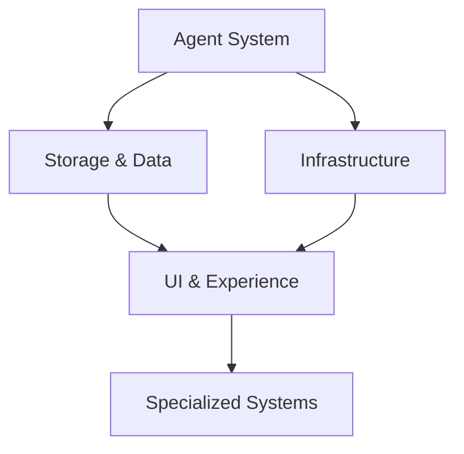

# Complete Feature Analysis by Core Component

Last Updated: 2025-06-29

## Overview
This document analyzes all proposed features grouped by their primary core component impact. This organization helps identify component-level dependencies, resource allocation needs, and architectural evolution patterns.

## Feature Classification Summary

**Total Features Analyzed:** 20
- Must Have: 11 features
- Should Have: 2 features  
- Could Have: 0 features
- Won't Have: 0 features
- Evaluations: 7 features

## Core Component Impact Analysis

### Agent System (7 features)
Core infrastructure for AI-driven content generation and quality management.

**Features:**

**Micro-Agent Specialization (ID: 20)** - Replace monolithic character enhancement with specialized micro-agents for voice, body language, and subtext. Evaluation recommends proceeding with significant simplification, starting with unified CharacterEnhancementAgent first.

**Agent Permission System (ID: 44)** - Comprehensive permission system enforcing strict domain boundaries between agents, preventing unauthorized modifications while ensuring data integrity through registry-based approach with inheritance support.

**Narrative Architect System (ID: 50)** - Cost-optimizing two-tier AI system where expensive "Narrative Architect" models plan complex changes and cheaper "Executor" models implement edits, targeting 60-80% cost reduction while improving narrative coherence.

**Intelligent Model Selection (ID: 51)** - Sophisticated model selection system optimizing task-to-model matching across multiple providers using "5x5" architecture with five model tiers and five quality profiles, targeting 50%+ cost reduction with 95%+ satisfaction.

**Architecture Review System (ID: 53)** - Architecture Review Agent analyzing project complexity after setup to provide optimized agent configurations and model selections, enabling informed cost/quality decisions before writing begins.

**Intelligent Quality Orchestrator (ID: 55)** - Intelligent quality orchestration system reducing quality loop iterations by 60% through smart restart decisions and impact-based management, preventing unnecessary LLM calls while maintaining 95% quality standards.

**Quality Orchestration (ID: 56)** - System analyzing change impact and selectively restarting only affected agents, reducing quality loop iterations by 60% through smart restart decisions and impact-based quality management.

| ID | Feature | Impact | Complexity | Strategic Value | Status |
|----|---------|--------|------------|-----------------|--------|
| 20 | Micro-Agent Specialization | Should Have | Large | Growth | PROCEED (simplified) |
| 44 | Agent Permission System | Must Have | Medium | Core | Approved |
| 50 | Narrative Architect System | Must Have | Large | Core | Approved |
| 51 | Intelligent Model Selection | Must Have | Large | Core | Approved |
| 53 | Architecture Review System | Must Have | Large | Core | Approved |
| 55 | Intelligent Quality Orchestrator | Must Have | Large | Core | Approved |
| 56 | Quality Orchestration | Should Have | Medium | Growth | Approved |

**Component Analysis:**
- **High Priority**: 6/7 features are Must Have, indicating agent system is critical path
- **Complexity**: Predominantly Large complexity features requiring significant architectural work
- **Dependencies**: Most features build on base agent system and require coordination
- **Risk**: High complexity concentration suggests need for careful sequencing

### Storage & Data Management (4 features)
Systems for content persistence, search, and metadata management.

**Features:**

**Metadata Inference Engine (ID: 46)** - Intelligent metadata inference system reducing YAML storage complexity by 80% through automated metadata generation and relationship inference, using smart defaults and schema optimization to eliminate overwhelming metadata maintenance.

**Search Index Abstraction (ID: 47)** - Search index abstraction layer decoupling storage from search functionality, enabling future vector search capabilities while maintaining SQLite integration through clean provider interface supporting multiple backend implementations.

**Progressive Setting System (ID: 49)** - Progressive setting elaboration system evolving with the story using three-tier approach, combining genre defaults, user overrides, and dynamically discovered details to balance worldbuilding depth with writing flow.

**Context Intelligence Pipeline (EVAL-005)** - Three-stage pipeline progressively filtering context from comprehensive to highly relevant: SQLite search retrieval, computational filtering using digital humanities techniques, and LLM-based final curation for thematic meaning.

| ID | Feature | Impact | Complexity | Strategic Value | Status |
|----|---------|--------|------------|-----------------|--------|
| 46 | Metadata Inference Engine | Must Have | Large | Core | Approved |
| 47 | Search Index Abstraction | Must Have | Medium | Core | Approved |
| 49 | Progressive Setting System | Must Have | Large | Core | Approved |
| EVAL-005 | Context Intelligence Pipeline | Must Have | Large | Core | PROCEED (staged) |

**Component Analysis:**
- **Strategic Importance**: All features are Must Have/Core, indicating foundational nature
- **Scalability Focus**: Features address scaling challenges for large manuscripts
- **Progressive Enhancement**: Emphasis on just-in-time data generation and intelligent caching
- **Search Evolution**: Moving from simple storage to intelligent context retrieval

### User Interface & Experience (2 features)
Systems for user interaction, workflow management, and experience optimization.

**Features:**

**UX Flow System (ID: 48)** - VS Code-inspired dual-path user interface providing both streamlined and guided experiences, enabling direct access for experienced writers while offering structured assistance for those needing guidance.

**Feature Pipeline System (ID: 52)** - Lightweight feature management system optimized for solo developers, providing clear tracking from idea capture through implementation using structured yet minimal process, targeting <4 week cycles with <10 minutes weekly overhead.

| ID | Feature | Impact | Complexity | Strategic Value | Status |
|----|---------|--------|------------|-----------------|--------|
| 48 | UX Flow System | Must Have | Large | Core | Approved |
| 52 | Feature Pipeline System | Must Have | Medium | Core | Approved |

**Component Analysis:**
- **User-Centric**: Both features directly impact user experience and workflow
- **VS Code Integration**: UX Flow leverages familiar development environment patterns
- **Process Optimization**: Feature Pipeline addresses solo developer workflow needs
- **Foundation**: These enable more sophisticated user interactions in future phases

### Infrastructure & Operations (4 features)
Core system infrastructure, security, and operational capabilities.

**Features:**

**Basic Security Linter (ID: 42)** - Basic security linter running pre-commit to detect common dangerous code patterns in issue processing scripts, focusing on top 5 critical patterns to provide immediate security value with minimal complexity.

**Cost Tracking System (ID: 43)** - Comprehensive cost tracking and analytics system monitoring LLM usage across all agents, enabling ROI validation, cost optimization, and transparent billing while providing data to validate 40-60% cost reduction claims.

**Feature Flag System (ID: 45)** - Comprehensive feature flag infrastructure enabling safe staged rollouts and A/B testing, providing granular control over feature deployment with context-aware evaluation, supporting data-driven feature development.

**Dependency Management (EVAL-001)** - Advanced dependency management system for long-form series, automatically tracking consistency across world rules, character continuity, plot threads, and timeline integrity with conflict detection and resolution strategies.

| ID | Feature | Impact | Complexity | Strategic Value | Status |
|----|---------|--------|------------|-----------------|--------|
| 42 | Basic Security Linter | Must Have | Small | Core | Approved |
| 43 | Cost Tracking System | Must Have | Medium | Core | Approved |
| 45 | Feature Flag System | Must Have | Medium | Core | Approved |
| EVAL-001 | Dependency Management | Must Have | Large | Core | PROCEED (staged) |

**Component Analysis:**
- **Operational Excellence**: Focus on security, cost management, and deployment safety
- **Risk Management**: Security and dependency features address system reliability
- **Business Intelligence**: Cost tracking enables data-driven optimization
- **Deployment Safety**: Feature flags enable safe rollout of complex features

### Specialized Systems (3 features)
Domain-specific systems for particular use cases or advanced capabilities.

**Features:**

**Example Progressive Setting (ID: 23)** - Template/example implementation of progressive setting system enabling "just-in-time" setting development, starting with genre-appropriate defaults and expanding naturally during writing while maintaining consistency.

**Elastic Agent Architecture (EVAL-002)** - Dynamic agent spawning based on project complexity, allowing PlotWeaver to scale computational resources precisely to match story needs instead of fixed agent assignments. Evaluation recommends deferring due to complexity concerns.

**Prompt Customization (EVAL-003)** - User-owned prompt customization and reference management system allowing users to customize AI prompts and model selection directly in their GitHub repository. Evaluation recommends rejecting due to complexity and scope concerns.

| ID | Feature | Impact | Complexity | Strategic Value | Status |
|----|---------|--------|------------|-----------------|--------|
| 23 | Example Progressive Setting | Should Have | Large | Growth | Template/Example |
| EVAL-002 | Elastic Agent Architecture | Could Have | Large | Growth | DEFER |
| EVAL-003 | Prompt Customization | Won't Have | Large | Enhancement | REJECT |

**Component Analysis:**
- **Mixed Priority**: Range from template examples to rejected features
- **Advanced Capabilities**: Features represent sophisticated but non-essential functionality
- **Future Considerations**: Elastic architecture deferred, prompt customization rejected
- **Specialization**: Features serve specific user segments rather than core functionality

## Cross-Component Dependencies

### Critical Path Analysis

### Dependency Matrix
| Component | Agent System | Storage | UI/UX | Infrastructure | Specialized |
|-----------|--------------|---------|-------|----------------|-------------|
| Agent System | - | High | Medium | High | Low |
| Storage | Medium | - | High | Medium | Medium |
| UI/UX | Low | Medium | - | Low | High |
| Infrastructure | Medium | Low | Low | - | Low |
| Specialized | High | High | Medium | Low | - |

## Implementation Sequencing

### Phase 1: Foundation (Months 1-2)
**Infrastructure & Core Agent System**
- Basic Security Linter (ID: 42) - 1 week
- Agent Permission System (ID: 44) - 2 weeks  
- Feature Flag System (ID: 45) - 2 weeks
- Cost Tracking System (ID: 43) - 2 weeks

### Phase 2: Core Capabilities (Months 2-4)
**Storage & Intelligence**
- Search Index Abstraction (ID: 47) - 3 weeks
- Metadata Inference Engine (ID: 46) - 4 weeks
- Context Intelligence Pipeline (EVAL-005) - 6 weeks (staged)

### Phase 3: User Experience (Months 4-5)
**Interface & Workflow**
- Feature Pipeline System (ID: 52) - 3 weeks
- UX Flow System (ID: 48) - 4 weeks

### Phase 4: Advanced AI (Months 5-7)
**Intelligent Systems**
- Architecture Review System (ID: 53) - 4 weeks
- Intelligent Model Selection (ID: 51) - 4 weeks
- Narrative Architect System (ID: 50) - 4 weeks

### Phase 5: Quality & Optimization (Months 7-8)
**Quality Management**
- Intelligent Quality Orchestrator (ID: 55) - 3 weeks
- Progressive Setting System (ID: 49) - 4 weeks
- Quality Orchestration (ID: 56) - 2 weeks

### Phase 6: Advanced Features (Months 8+)
**Specialized Capabilities**
- Dependency Management (EVAL-001) - 6 weeks (staged)
- Micro-Agent Specialization (ID: 20) - 4 weeks (simplified)

## Resource Allocation Analysis

### Development Effort Distribution
- **Agent System**: 35% (7 features, high complexity)
- **Storage & Data**: 25% (4 features, foundational)
- **Infrastructure**: 20% (4 features, essential)
- **UI/UX**: 15% (2 features, user-facing)
- **Specialized**: 5% (3 features, optional/deferred)

### Complexity Distribution
- **Small**: 1 feature (5%)
- **Medium**: 6 features (30%)
- **Large**: 13 features (65%)

### Risk Assessment by Component

#### High Risk Components
1. **Agent System**: High complexity concentration, coordination challenges
2. **Storage & Data**: Scalability requirements, performance constraints

#### Medium Risk Components
3. **Infrastructure**: Security and operational requirements
4. **UI/UX**: User experience complexity, VS Code integration

#### Low Risk Components
5. **Specialized**: Optional features, can be deferred

## Success Metrics by Component

### Agent System
- Quality improvement: >20% better consistency
- Cost optimization: 50-80% reduction through smart routing
- Performance: <200ms decision time for quality orchestration

### Storage & Data Management  
- Scalability: Support 100+ scene manuscripts
- Search performance: <100ms context retrieval
- Metadata reduction: 80% YAML size reduction

### User Interface & Experience
- User satisfaction: >90% understanding of system
- Workflow efficiency: <10 minutes weekly overhead
- Adoption: >70% feature utilization

### Infrastructure & Operations
- Security: Zero critical vulnerabilities
- Cost visibility: ±20% cost estimate accuracy  
- Deployment safety: Zero production incidents

## Strategic Recommendations

### Immediate Actions (Next 30 days)
1. **Begin Phase 1 implementation** with Basic Security Linter
2. **Establish component ownership** for each major system
3. **Create detailed technical specifications** for Agent System features
4. **Set up monitoring infrastructure** for success metrics

### Medium-term Strategy (3-6 months)
1. **Focus on Agent System maturity** before advanced features
2. **Validate storage scalability** with real-world manuscripts
3. **User testing throughout** UI/UX development
4. **Continuous cost optimization** measurement

### Long-term Vision (6+ months)
1. **Evaluate specialized systems** based on user feedback
2. **Consider elastic architecture** if scaling demands justify complexity
3. **Explore marketplace opportunities** enabled by mature infrastructure
4. **Plan for third-party integrations** using established component boundaries

## Notes
- Features marked as "Evaluation" require final approval before implementation
- Complexity estimates may change as architecture evolves
- Cross-component dependencies may affect implementation order
- Regular review recommended as user feedback influences priorities
