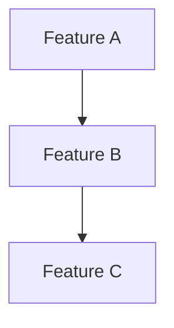

# Feature Analysis & Prioritization

Last Updated: 2025-06-29

## Overview
This document tracks feature proposals and their relative priority based on impact, complexity, and strategic value. Features are grouped by their classification to inform roadmap planning.

## Classification Guide

Impact:
- Must Have: Critical for core functionality
- Should Have: Important but not critical
- Could Have: Beneficial but optional
- Won't Have: Out of scope for now

Complexity:
- Small: Single component, clear scope
- Medium: Multiple components, manageable dependencies
- Large: System-wide impact, complex dependencies
- XLarge: Architectural changes, high risk

Strategic Value:
- Core: Essential to product vision
- Growth: Enables future capabilities
- Enhancement: Improves existing features
- Optional: Nice to have

## Current Analysis

### Must Have Features
| ID | Feature | Complexity | Strategic Value | Dependencies | Notes |
|----|---------|------------|-----------------|--------------|-------|
|    |         |            |                 |              |       |

### Should Have Features
| ID | Feature | Complexity | Strategic Value | Dependencies | Notes |
|----|---------|------------|-----------------|--------------|-------|
|    |         |            |                 |              |       |

### Could Have Features
| ID | Feature | Complexity | Strategic Value | Dependencies | Notes |
|----|---------|------------|-----------------|--------------|-------|
|    |         |            |                 |              |       |

### Won't Have (Now)
| ID | Feature | Complexity | Strategic Value | Rationale | Future Consideration |
|----|---------|------------|-----------------|-----------|---------------------|
|    |         |            |                 |           |                     |

## Dependencies Graph

## Strategic Groupings

### Core Platform
Features that enhance the fundamental capabilities:
- [Feature links]

### User Experience
Features that improve the writing experience:
- [Feature links]

### Technical Debt
Features that improve system health:
- [Feature links]

### Future Growth
Features that enable future capabilities:
- [Feature links]

## Decision Log
Track significant prioritization decisions and rationale:

YYYY-MM-DD: [Decision and reasoning]

## Notes
- Features can move between categories as priorities shift
- Dependencies may affect final implementation order
- Complexity may change as architecture evolves