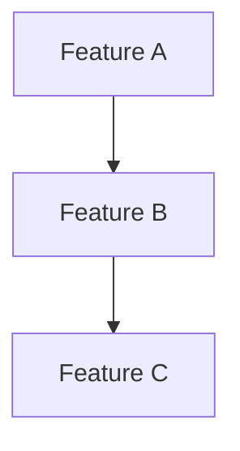

# Feature Analysis & Prioritization

Last Updated: 2025-06-29

## Overview
This document tracks feature proposals and their relative priority based on impact, complexity, and strategic value. Features are grouped by their classification to inform roadmap planning.

## Classification Guide

**Priority (MoSCoW):**
- Must Have: Critical for core functionality
- Should Have: Important but not critical
- Could Have: Beneficial but optional
- Won't Have: Out of scope for now

**Effort Estimation:**
- Quick (1-2 days): Single component, clear implementation
- Medium (3-7 days): Multiple components, some research needed
- Large (1-3 weeks): System-wide changes, significant testing
- Epic (1+ months): Major architectural changes, high uncertainty

**Strategic Value:**
- Core: Essential to product vision
- Growth: Enables future capabilities
- Enhancement: Improves existing features
- Maintenance: Technical debt, refactoring

**User Impact:**
- High: Directly improves user experience
- Medium: Behind-the-scenes improvements users will notice
- Low: Technical improvements, minimal user-facing changes

## Current Analysis

### Must Have Features
| ID | Feature | Effort | Strategic Value | User Impact | Dependencies | Notes |
|----|---------|--------|-----------------|-------------|--------------|-------|
|    |         |        |                 |             |              |       |

### Should Have Features
| ID | Feature | Effort | Strategic Value | User Impact | Dependencies | Notes |
|----|---------|--------|-----------------|-------------|--------------|-------|
|    |         |        |                 |             |              |       |

### Could Have Features
| ID | Feature | Effort | Strategic Value | User Impact | Dependencies | Notes |
|----|---------|--------|-----------------|-------------|--------------|-------|
|    |         |        |                 |             |              |       |

### Won't Have (Now)
| ID | Feature | Effort | Strategic Value | Rationale | Future Consideration |
|----|---------|--------|-----------------|-----------|---------------------|
|    |         |        |                 |           |                     |

### Quick Wins (High Impact, Low Effort)
Features that provide immediate value with minimal investment:
- [Feature links]

## Dependencies Graph

## Strategic Groupings

### Sprint-Ready (Next 1-2 weeks)
Features ready for immediate implementation:
- [Feature links]

### Research Phase (Next month)
Features requiring investigation before implementation:
- [Feature links]

### Core Platform
Features that enhance the fundamental capabilities:
- [Feature links]

### User Experience
Features that improve the writing experience:
- [Feature links]

### Technical Health
Features that improve system maintainability:
- [Feature links]

### Future Growth
Features that enable future capabilities:
- [Feature links]

## Decision Log
Track significant prioritization decisions and rationale:

YYYY-MM-DD: [Decision and reasoning]

## Solo Developer Guidelines

**Prioritization Tips:**
- Balance user-facing features with technical improvements (70/30 split)
- Consider your energy levels - tackle complex features when fresh
- Group related features to maintain context and momentum

**Time Management:**
- Quick wins can provide motivation between larger efforts
- Dependencies can block progress - identify and resolve early
- Document decisions to avoid re-researching later

## Notes
- Features can move between categories as priorities shift
- Dependencies may affect final implementation order
- Effort estimates may change as architecture evolves
- Consider personal motivation and energy when scheduling work
